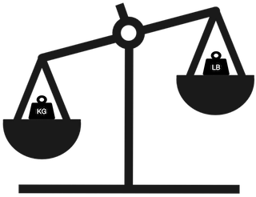
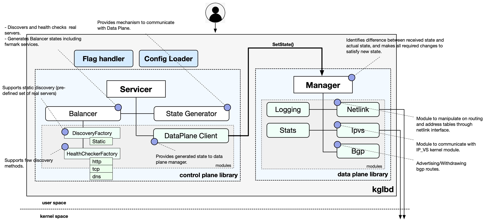

# KgLb   

KgLb is L4 a load balancer built on top of linux ip virtual server (ip_vs). 



It provides rich functionality such as discovery, health checks for real servers, automatically update their weights based on status, and apply all required changes to make ipvs alive including registering virtual services, updating reals and adding required vip addresses.

## Overview
KgLb consists of two key components called Control Plane and Data Plane. Both components are written as libraries and based on a few modules which follow predefined interfaces. Next picture shows high-level overview of KgLb internals.


* Control Plane is a library which discovers, health checks real servers, and generates data plane state:
  * Services is a library which creates set of Balancers according received configuration, generates data plane state and applies it via DataPlaneClient interface.
  * Balancer discovers, health checks and generate single or multiple BalancerState which represents single ipvs service. Balancer may generate extra fwmark states when health checking via fwmark is enabled.
  * StateGenerator generates complete Data Plane state based on ControlPlane config and generated Balancers.
  * DiscoveryFactory is an interface to create appropriate discovery instance based on configuration. Open version supports statis discovery method only (pre-defined set of hosts provided in config).
  * HealthCheckerFactory is an interface to create required health checking instance instane. Currently supported checks are: http including http proxy, tcp, dns, syslog.
  * DataPlaneClient provides communication interface with DataPlane. Current imlementation of DataPlaneClient in kglbd consists of simple API call of data plane, but it might provides grpc or rest bridge when control plane and data plane are separate services.
* Data Plane is a library which represents middle layer between control pland and multiple system components, and makes system changes based on received data plane state. Today Data Plane can do following:
  * add/delete ip address.
  * interact with ip_vs module (ipvs service creation/deletion + updating real servers).
  
## Requirements
- Go 1.13
- Linux Kernel 4.4+
- protoc 3.6.1+ and protoc-gen-go

## Supported features
- Discovery: static only.
- Health Checkers: http, dns, syslog, tcp.
- Tunneled health checking through fwmarks.
- Stats exported in prometheus format and available on http://127.0.0.1:5678/stats by default.
- Graceful shutdown.

## Installation
```bash
# Compile protobufs
pushd ./proto
protoc --go_out=. ./dropbox/proto/kglb/healthchecker/healthchecker.proto
protoc --go_out=. ./dropbox/proto/kglb/*.proto
popd

# Compiling
go build -o kglbd.bin ./kglbd
```

## Quick start
```bash
sudo ./kglbd.bin -config=./examples/example_config.json -logtostderr
```

## Next Steps
- Releasing bgp module.
- Integration with .
